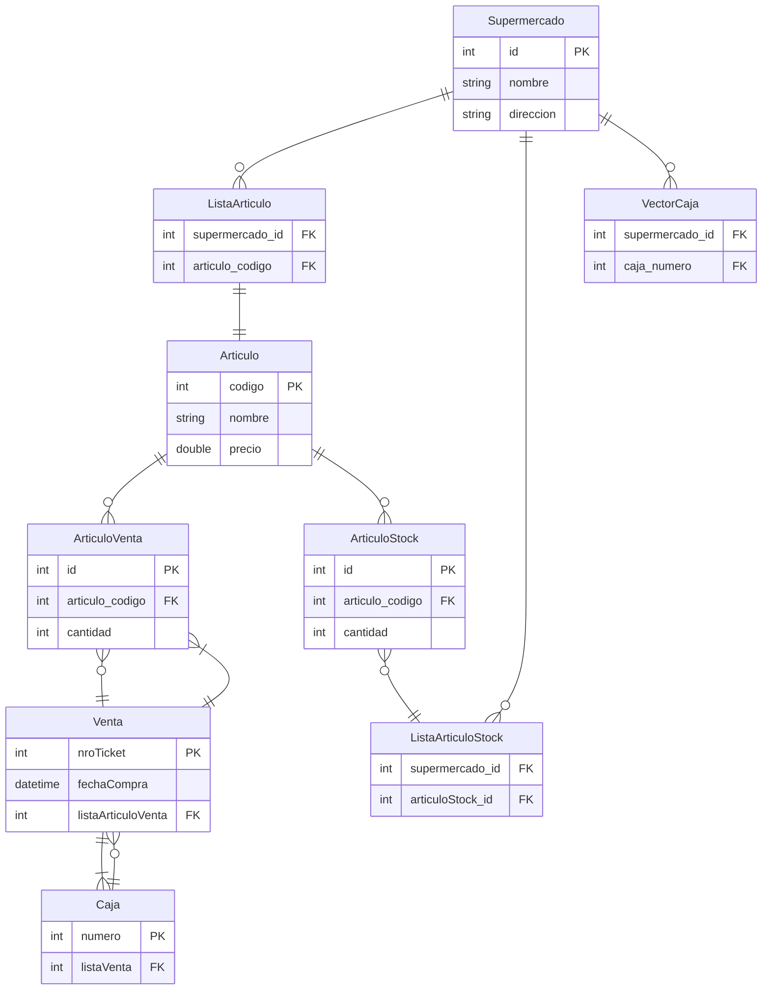

# EduFacil

```mermaid
    erDiagram
    Articulo {
        int codigo PK
        string nombre
        double precio
    }

    ArticuloVenta {
        int id PK
        int articulo_codigo FK
        int cantidad
    }

    Venta {
        int nroTicket PK
        datetime fechaCompra
        int listaArticuloVenta FK
    }

    ArticuloStock {
        int id PK
        int articulo_codigo FK
        int cantidad
    }

    ListaArticulo {
        int supermercado_id FK
        int articulo_codigo FK
    }

    ListaArticuloStock {
        int supermercado_id FK
        int articuloStock_id FK
    }

    Caja {
        int numero PK
        int listaVenta FK
    }

    Supermercado {
        int id PK
        string nombre
        string direccion
    }

    VectorCaja {
        int supermercado_id FK
        int caja_numero FK
    }

    Articulo ||--o{ ArticuloVenta : ""
    Articulo ||--o{ ArticuloStock : ""
    Venta ||--|{ ArticuloVenta : ""
    Venta ||--|{ Caja : ""
    Supermercado ||--o{ ListaArticulo : ""
    Supermercado ||--o{ ListaArticuloStock : ""
    Supermercado ||--o{ VectorCaja : ""
    Caja ||--o{ Venta : ""
    ArticuloVenta }o--|| Venta : ""
    ArticuloStock }o--|| ListaArticuloStock : ""
    ListaArticulo ||--|| Articulo : ""
```